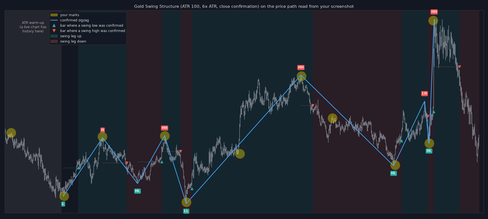

# Gold Swing Structure (TradingView indicator)

A swing-high / swing-low and trend indicator for XAUUSD (tuned on the 1-minute chart, works on any
symbol and timeframe). It marks the real turning points and skips the small wiggles that fractal,
pivot and oscillator signals keep firing on.



## Install

1. TradingView → **Pine Editor** → *Open* → *New blank indicator*.
2. Replace everything with the contents of [`gold_swing_structure.pine`](gold_swing_structure.pine).
3. **Save**, then **Add to chart**.

## How it separates real swings from fakes

It combines three filters:

| Filter | What it does | Fake it removes |
|---|---|---|
| **Volatility-sized reversal** | A high/low only counts once price comes back from it by `Reversal × ATR(100)` (default 6 × ATR). | Small pullbacks and noise inside a move. ATR makes the size follow gold's volatility: smaller in quiet Asian hours, larger in London/NY and around news. |
| **Close confirmation** | The reversal must happen on a candle **close**, not just a wick. | Stop-hunt wicks and news spikes that snap straight back. |
| **Market structure** | Each confirmed swing is labelled HH / HL / LH / LL, and the structure trend only flips when a candle closes beyond the last confirmed swing. | Counter-trend swings. They stay visible, but the structure doesn't flip on them. |

## Reading the chart

- **HH / HL / LH / LL labels** sit on the exact high/low bar.
- **Small triangles** mark the bar where each swing was *confirmed*. This is when you could
  actually have known about it. ▲ = swing low confirmed (leg turned up), ▼ = swing high confirmed
  (leg turned down).
- **Dashed line + dotted level** show the current, unconfirmed leg and the close that would confirm
  the next swing ("Swing low confirms on a close ≥ …").
- **Background**: *Swing leg* (default) is green after a confirmed low and red after a confirmed high.
  *Market structure* is slower. It turns up/down only when a close breaks the last swing high/low.
- **Table** (top right): swing leg, structure, last swing, and the reversal currently required in $.
- **Alerts**: *Swing low confirmed*, *Swing high confirmed*, *Structure turned UP/DOWN*. Create
  them with **Once Per Bar Close**.

Confirmed swings never move or disappear. The script only acts on closed candles, so nothing
flickers inside a live bar either.

## The honest limit

**No indicator can tell a real swing from a fake at the moment it prints.** Any tool that shows
only the perfect tops and bottoms is either redrawing its history (repainting) or confirming
later and drawing the label back in time. This one does the second, openly: the label goes on
the extreme, and the triangle shows when it was known.

On the chart in the image, the default settings confirmed swings 6–44 bars after the extreme.
By then a median of about 40% of the move was still left (from 11% to 77% across the 9 legs).
That lag is the price of skipping the fakes:

- **Larger `Reversal`**: fewer, cleaner swings, later confirmation.
- **Smaller `Reversal`**: earlier confirmation, more small swings.

## Settings

| Setting | Default | Notes |
|---|---|---|
| ATR length | 100 | ≈ the last 1.5 h on 1m. |
| Reversal (× ATR) | 6 | 5–7 on XAUUSD 1m. Use **4** to also catch small pullback swings (e.g. the higher low just before a breakout). This roughly doubles the number of swings. |
| Minimum reversal (price) | 0 | Optional $ floor, e.g. `3` = never smaller than $3. |
| Confirm on candle close | on | Off = wicks can confirm. Faster, but news spikes can create a fake low/high pair. |

Other timeframes (5m, 15m) use the same logic but were not tuned here. Start from the defaults and
adjust `Reversal`.

## Check against the marked screenshot

I rebuilt the price path of the marked XAUUSD 1m screenshot from its pixels and ran the defaults on it:

- **8 of the 11 marks** were detected as swings.
- **1** (the high at the far left) falls inside the first 100 bars, where the ATR is still warming
  up. A live chart has history there, so it isn't a real miss.
- **2** (the higher low right before the breakout, and the lower high after the top) are small
  pullbacks, about half the size of the other swings. They only look important in hindsight.
  `Reversal = 4` picks up the lower high, along with about 10 more swings.
- **Only 2 extra swings** were found: the low between the two marked highs on the left, and the high
  between the two marked lows on the right. Both are real swings. A zigzag needs them because highs
  and lows must alternate.

This check uses one screenshot, not a backtest. Before trading it, run it on a few weeks of your own
data with the Python reference below.

## Python reference (offline testing)

[`reference/swing_detector.py`](reference/swing_detector.py) is a line-for-line port of the Pine
logic. Use it on data exported from TradingView (chart menu → *Export chart data…*):

```bash
cd reference
python swing_detector.py XAUUSD_1m.csv --rev-mult 6 --atr-len 100   # add --wick for wick confirmation
python -m unittest -v                                               # tests, including a no-repaint check
```

It prints every swing with the bar where it was confirmed, so you can measure the lag and
tune `Reversal` on your own history.
